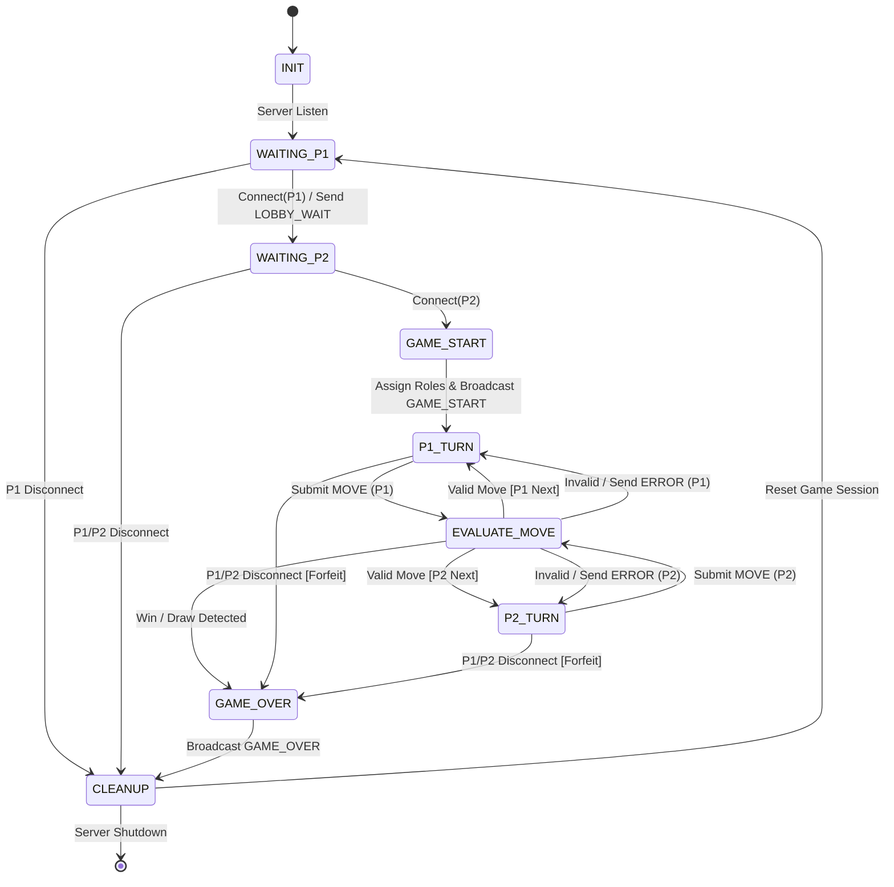

# Server Game Finite State Machine (FSM) Specification

## 1. Overview
The server state engine governs player session lifetimes, game setup, turn control, move validation, error handling, and state transitions during orderly and abrupt client departures.

---

## 2. Mermaid FSM Diagram (`stateDiagram-v2`)

---

## 3. Detailed State & Transition Specification

### 3.1 `INIT`
* **Description**: Server initializes networking socket, binds host/port, and enters non-blocking or multi-threaded listen loop.
* **Transitions**: Moves to `WAITING_P1` upon successful socket binding.

### 3.2 `WAITING_P1` & `WAITING_P2`
* **Description**: Server listens for client connections in the lobby.
  * **P1 Connect**: Assigns role `PLAYER_1`, sends `LOBBY_WAIT`.
  * **P2 Connect**: Assigns role `PLAYER_2`.
* **Transitions**:
  * Moves to `GAME_START` when both clients connect.
  * Moves to `CLEANUP` if a player disconnects while waiting.

### 3.3 `GAME_START`
* **Description**: Game engine constructs a fresh board matrix, sets `active_turn = PLAYER_1`, and broadcasts `GAME_START` containing assigned symbols (`X` for P1, `O` for P2).
* **Transitions**: Automatically transitions into `P1_TURN`.

### 3.4 `P1_TURN`, `P2_TURN` & `EVALUATE_MOVE`
* **Description**:
  * Active player submits a `MOVE` frame.
  * `EVALUATE_MOVE` verifies:
    1. **Turn Identity**: Is `msg.player_id == active_turn`?
    2. **Coordinate Bounds**: Are `row` and `col` within allowable grid dimensions?
    3. **Cell Availability**: Is target square unconsumed?
* **Transitions & Edge Case Handling**:
  * **Valid Move (Ongoing)**: Updates board state and transitions to `P2_TURN` or `P1_TURN`.
  * **Valid Move (Terminal)**: If a win, loss, or draw condition is detected, transitions directly to `GAME_OVER`.
  * **Out-of-Turn or Invalid Payload**: Emits an `ERROR` frame back to the offending client and remains in the current player's turn state.
  * **Client Disconnect / Socket Failure**: Immediately triggers transition to `GAME_OVER` with `reason = FORFEIT_DISCONNECT`.

### 3.5 `GAME_OVER`
* **Description**: Halts turn state engine. Determines final state payload (Win, Draw, or Forfeit) and emits `GAME_OVER` to all reachable client sockets.
* **Transitions**: Unconditionally transitions to `CLEANUP`.

### 3.6 `CLEANUP`
* **Description**: Closes disconnected client sockets, releases game session buffers, resets internal state registers, and prepares the room context for new incoming connections.
* **Transitions**: Transitions to `WAITING_P1`.
